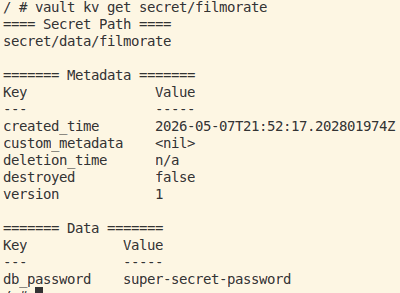
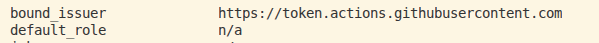
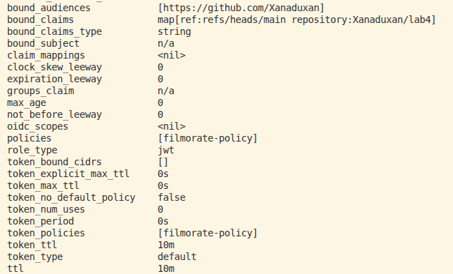

Лабораторная 4

Карпова Ольга

### Часть 1

# Плохие практики CI/CD

## Отсутствие кэширования

Зависимости скачиваются заново при каждом запуске pipeline, из-за чего сборка работает медленнее.

```yaml
- name: Set up Java 21 without cache
  uses: actions/setup-java@v4
  with:
    distribution: temurin
    java-version: 21
```

---

## Отсутствие rollback

При неудачном деплое нельзя автоматически вернуться к предыдущей стабильной версии приложения.

```yaml
- name: Deploy simulation without rollback
  run: |
    echo "Deploying application..."
    echo "No rollback configured"
```

---

## Отсутствие мониторинга и метрик

Pipeline не собирает информацию о времени сборки, ошибках и результатах тестов.

```yaml
- name: No metrics
  run: |
    echo "Pipeline finished"
```

---

## Flaky tests

Тесты могут случайно проходить или падать без изменений в коде, из-за чего pipeline становится ненадёжным.

```yaml
- name: Flaky test simulation
  run: |
    NUMBER=$(( RANDOM % 2 ))
    if [ "$NUMBER" -eq 0 ]; then
      echo "Random failure"
      exit 1
    fi
    echo "Random success"
```

---

## Отсутствие параллелизации

Все этапы pipeline выполняются последовательно, что увеличивает время выполнения CI/CD.

```yaml
- name: Run everything sequentially
  run: |
    mvn -B compile
    mvn -B test
    mvn -B package
```

# Исправление плохих практик CI/CD

## Отсутствие кэширования

В плохом pipeline Maven зависимости скачивались заново при каждом запуске.

Исправлено:

```yaml
- name: Set up Java 21 with Maven cache
  uses: actions/setup-java@v4
  with:
    distribution: temurin
    java-version: 21
    cache: maven
```

Maven использует cache и не скачивает зависимости заново при каждом запуске pipeline.

---

## Отсутствие rollback

В плохом pipeline отсутствовала возможность восстановления предыдущей версии приложения.

Исправлено:

```yaml
- name: Upload rollback artifact
  uses: actions/upload-artifact@v4
  with:
    name: rollback-version
    path: previous-version/app.jar
```

Теперь предыдущая версия приложения сохраняется как artifact и может быть использована для rollback.

---

## Отсутствие мониторинга и метрик

В плохом pipeline отсутствовала информация о выполнении pipeline.

Исправлено:

```yaml
- name: Add build metrics
  run: |
    echo "## Build metrics" >> $GITHUB_STEP_SUMMARY
    echo "- Maven cache enabled" >> $GITHUB_STEP_SUMMARY
```

Теперь GitHub Actions отображает краткие метрики и информацию о выполнении pipeline.

---

## Flaky tests

В плохом pipeline использовался случайный тест, который мог завершаться ошибкой без изменений в коде.

Исправлено:

```yaml
- name: Run stable tests
  run: mvn -B test
```

Теперь pipeline использует только стабильные тесты проекта.

---

## Отсутствие параллелизации

В плохом pipeline все этапы выполнялись последовательно.

Исправлено:

```yaml
jobs:
  compile:
  tests:
```

Сборка запускается только после успешного завершения compile и тестов:

```yaml
needs:
  - compile
  - tests
```

Теперь jobs выполняются параллельно, что ускоряет выполнение pipeline.


### Часть 2

## Почему хранение секретов в CI/CD переменных репозитория не является хорошей практикой

- Секреты привязаны к одному конкретному репозиторию.
- Ими неудобно управлять и сложно контроллировать, если проектов становится много.
- Изменения секретов возможны только вручную.
- Секрет может "утечь" из-за ошибок в pipeline
- Настроить гибкие политики доступа становится сложнее.

## Работа с секретами через Vault и OIDC

Для работы с секретами была выбрана связка **GitHub Actions + HashiCorp Vault + OIDC**.

Секреты хранятся во внешнем хранилище Vault, а GitHub Actions получает доступ через временный OIDC-токен.

## Запуск Vault

```bash
sudo docker run --name vault \
  -e VAULT_DEV_ROOT_TOKEN_ID=root \
  -e VAULT_DEV_LISTEN_ADDRESS=0.0.0.0:8200 \
  -p 8200:8200 \
  vault:1.13.3
```

## Настройка Vault

```bash
sudo docker exec -it vault sh
export VAULT_ADDR=http://127.0.0.1:8200
export VAULT_TOKEN=root
```

## Создание секрета

```bash
vault kv put secret/filmorate db_password="super-secret-password"
```



## Настройка OIDC

```bash
vault auth enable jwt
```

```bash
vault write auth/jwt/config \
  bound_issuer="https://token.actions.githubusercontent.com" \
  oidc_discovery_url="https://token.actions.githubusercontent.com"
```



## Настройка доступа

```bash
vault policy write filmorate-policy - <<EOF
path "secret/data/filmorate" {
  capabilities = ["read"]
}
EOF
```

```bash
vault write auth/jwt/role/filmorate-github-actions \
  role_type="jwt" \
  bound_audiences="https://github.com/Xanaduxan" \
  user_claim="actor" \
  policies="filmorate-policy" \
  ttl="10m"
```



## Результат

Vault хранит секрет отдельно от репозитория. GitHub Actions получает доступ к нему через OIDC. К сожалению, это теоритическая реализация. Локально Vault был настроен и проверен, но GitHub Actions не сможет обратиться к localhost на моей машине.
